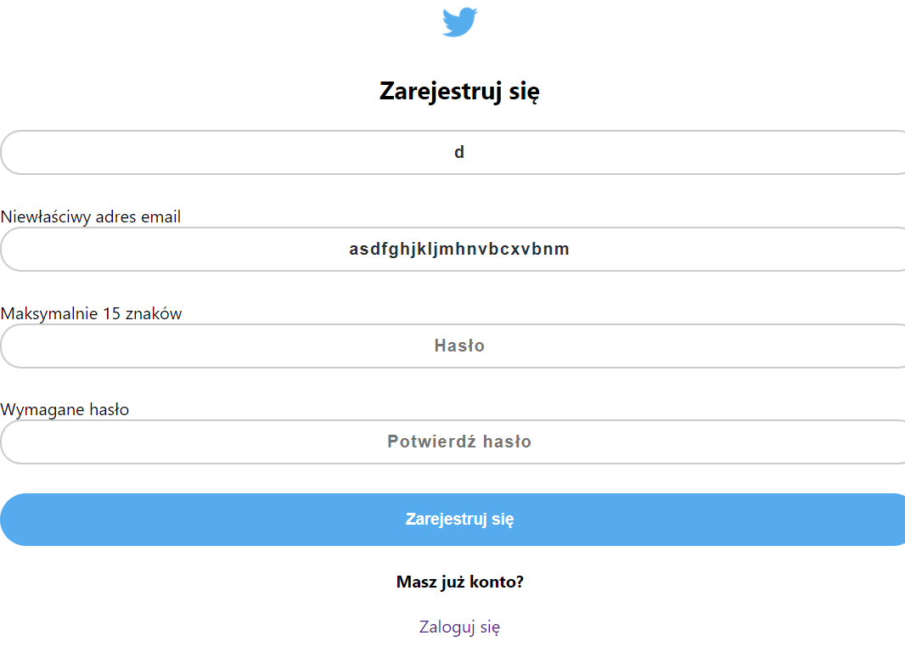

# Niby Twitter

Aplikacja mająca być kopią Twittera, w produkcji.

# Twórcy:

Janikowski Mateusz

Łukasz Mieczkowski

# Wykorzystane technologie: 

* [Visual Studio Code](https://code.visualstudio.com/)

* [Nodejs](https://nodejs.org/en/)

* [Graphql](https://graphql.org/)

* [Prisma](https://www.prisma.io/)

* [Postgres](https://www.postgresql.org/)

* [Typescript](https://www.typescriptlang.org/)

* [React](https://pl.reactjs.org/)

* [Apollo-client](https://www.apollographql.com/docs/react/)

# Uruchamianie:

aby uruchomić backend należy wpisać komendę

  ```	
	cd server
  npm run dev
```

następnie, że by uruchomić front end otwieramy kolejny terminal i wpisujemy

  ```	
	cd web
  yarn start
```

# Funkcjonalności

Aplikacja ma główną stronę, która włącza się nawet przy niepoprawnym kodzie http


Aplikacja ma podstawową obsługę błędów podczas rejestracji jak i logowania




Aplikacja po poprawnym logowaniu i rejestracji tworzy token który jest zapamiętywany


